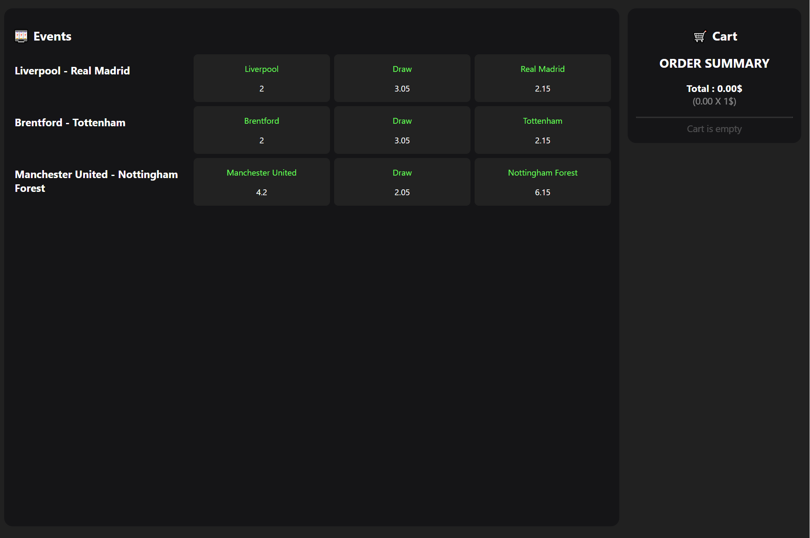
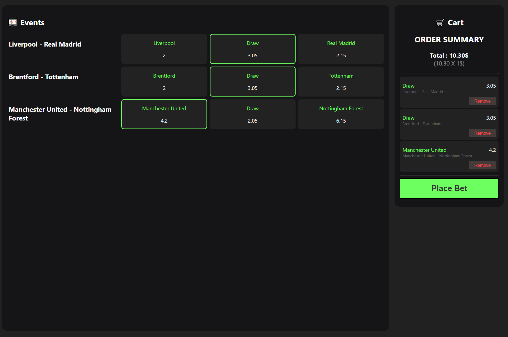
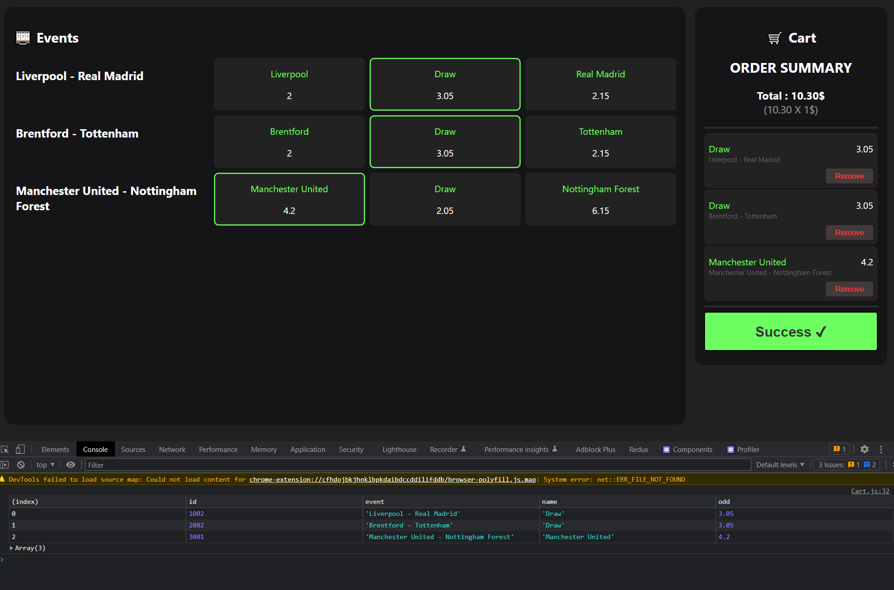

# React test task

You have some API for sport events and for placing bets. You can use json files (prepare
structure for it).\
You need to create page with events (get it from json file by request). Minimum 3 events, each
event has few outrights with odds.\
When we tap by outright it adds in shopping cart.\
In shopping cart page we can see all outrights, which we tapped and “place bet” button. By
taping this button data is sending (sending imitation).\
Response can be success or error. You can imitate this cases.

## How to run

In the project directory, you can run:

### `npm install`
### `npm start`

Runs the app in the development mode.\
Open [http://localhost:3000](http://localhost:3000) to view it in your browser.

The page will reload when you make changes.\
You may also see any lint errors in the console.

## Some screenshots

